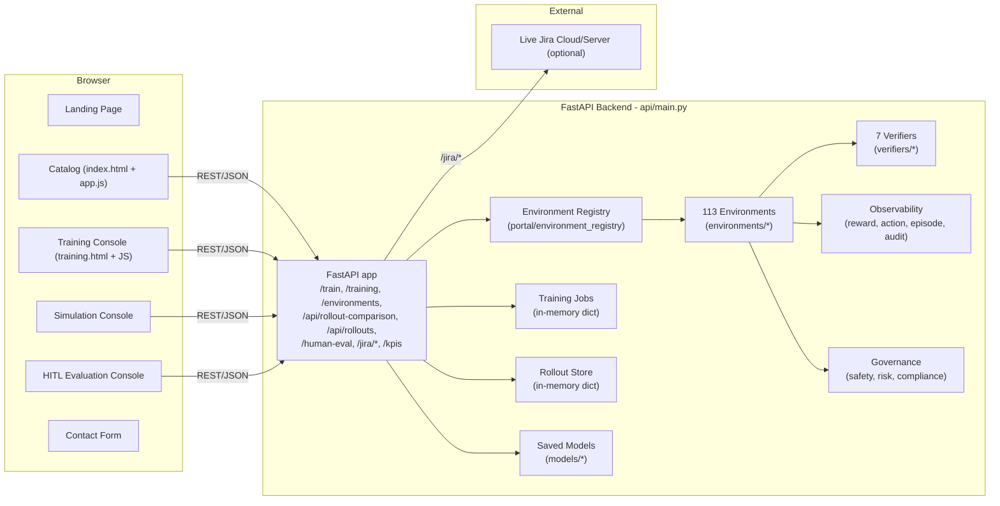

## AgentWork Simulator – Architecture & Requirements

This document captures the current architecture, product vision, requirements, and testing/operational model for **AgentWork Simulator** as implemented in this repository.

---

## 1. Product Vision

**AgentWork Simulator** is a platform for:

- **Designing, simulating, and training** reinforcement learning (RL) agents across **113 Gymnasium-compatible environments** spanning healthcare, enterprise, and HR/payroll workflows.
- **Bridging multiple domains**:
  - **Healthcare & operations** environments (clinical, imaging, hospital operations, revenue cycle, population health, telehealth, clinical trials, interoperability, cross-workflow).
  - **HR & payroll** environments (Workday, SAP SuccessFactors, ADP).
  - **Jira workflow** environments (Issue Resolution, Status Update, Comment Management, Subtask Management).
- Providing a **full loop from design → simulation → training → evaluation** so domain experts can:
  - Explore environments and understand what they optimize.
  - Run interactive simulations to understand behavior.
  - Train RL policies with GRPO, PPO, DPO, or A2C algorithms.
  - Compare pre- and post-training rollouts side by side with named tool calls, verifier results, and final environment state.
  - Perform **human-in-the-loop (HITL) evaluation** of model outputs, with structured scoring.

The deployment target is **Azure** (Dockerized FastAPI backend serving static frontends).

---

## 2. Tech Stack

| Layer | Technology |
|-------|-----------|
| **Backend** | Python 3.11, FastAPI, Uvicorn |
| **Frontend** | Vanilla HTML/JS/CSS (no build step, no framework) |
| **RL Framework** | Gymnasium, Stable-Baselines3, PyTorch |
| **Data** | In-memory (training jobs, rollouts); PostgreSQL schema available |
| **Deployment** | Docker, Azure |
| **Testing** | Pytest |
| **Version Control** | Git, GitHub |

### Frontend Assets (`api/static/`)

| File | Purpose |
|------|---------|
| `landing.html` + `landing.css` | Landing page with hero, features, CTA |
| `index.html` + `app.js` + `styles.css` | Environment catalog with filtering and detail overlays |
| `training.html` + `training.js` + `training.css` | Training console (stepper, charts, rollout comparison) |
| `training-config-data.js` | Training scenarios, agents, algorithms, 2 sample training runs |
| `simulation-console.html` + `simulation-console.js` + `test-console.css` | Interactive simulation engine |
| `human-eval.html` + `human-eval.css` | Human-in-the-loop evaluation console |
| `rollout-comparison.js` | Side-by-side rollout renderer with tool calls and verifier results |
| `contact.html` | Feedback/contact form |
| `global-nav.css` | Shared navigation bar styles |
| `toast.js` + `toast.css` | Toast notification system |
| `verifier-data.js` | Verifier configuration data |

### Backend (`api/main.py`)

Single FastAPI application handling:
- REST API for training, rollouts, monitoring, KPIs, Jira operations, and human evaluation
- Static asset serving for all frontend pages
- In-memory training job store with background task execution
- Enriched rollout data pipeline (numeric actions → named tool calls with verifier results)

---

## 3. High-Level System Overview

### 3.1 Main Components

- **FastAPI backend (`api/main.py`)**
  - REST API for training, monitoring, KPIs, Jira operations, rollout comparison, and human evaluation.
  - Serves static assets for 6 HTML pages.
  - Manages in-memory training jobs (`training_jobs` dict) and rollout store (`rollout_store` dict, seeded with demo rollouts at startup).
  - Enriches training step data with named tool calls, verifier results, and final environment state for rollout comparison rendering.

- **Environments (`environments/`) — 113 across 12 packages**
  - `base_environment.py` — `HealthcareRLEnvironment` base class implementing the Gymnasium interface (`reset`, `step`, `action_space`, `observation_space`).
  - Domain packages:

  | Package | Count | Systems |
  |---------|-------|---------|
  | `clinical/` | 20 | Epic, Cerner, Allscripts |
  | `imaging/` | 15 | Philips, GE Healthcare, PACS |
  | `population_health/` | 15 | Health Catalyst, Innovaccer |
  | `revenue_cycle/` | 15 | Change Healthcare |
  | `clinical_trials/` | 15 | Veeva, IQVIA |
  | `hr_payroll/` | 9 | Workday, SAP SuccessFactors, ADP |
  | `hospital_operations/` | 5 | Staffing, OR Scheduling, Supply Chain |
  | `telehealth/` | 5 | Teladoc, Amwell |
  | `interoperability/` | 5 | InterSystems, Orion Health |
  | `cross_workflow/` | 5 | Multi-agent coordination |
  | `jira/` | 4 | Atlassian Jira Cloud/Server |

  - `jira/jira_workflow_env.py` — encapsulates Jira workflows defined in `apps/workflow_definitions/jira_workflows.json`, maps numeric actions to named tool calls (`get_issue_summary_and_description`, `get_transitions`, `transition_issue`, etc.), and returns rich `transition_info` from `step()`.

- **Environment registry (`portal/environment_registry.py`)**
  - Discovers and describes all 113 environments via a registry JSON.
  - `list_all_environments()` and `get_environment_class()` used by the API and frontends.

- **Verifiers (`verifiers/`) — 7 types**

  | Verifier | File | Purpose |
  |----------|------|---------|
  | Base | `base_verifier.py` | Abstract interface |
  | Clinical | `clinical_verifier.py` | Clinical outcome quality |
  | Operational | `operational_verifier.py` | Workflow efficiency |
  | Financial | `financial_verifier.py` | Cost and revenue metrics |
  | Compliance | `compliance_verifier.py` | Regulatory adherence |
  | Jira | `jira_verifier.py` | Tool sequence and transition validation |
  | Ensemble | `ensemble_verifier.py` | Multi-verifier aggregation |

  - `verifier_registry.py` provides central registration and lookup.

- **Observability (`observability/`)**
  - `RewardLogger` — tracks reward signals per episode.
  - `ActionTraceLogger` — logs action sequences.
  - `EpisodeMetricsTracker` — captures episode-level KPIs.
  - `AuditLogger` — records audit trail for governance.

- **Governance (`governance/`)**
  - `safety_guardrails.py` — enforces safe action ranges.
  - `risk_thresholds.py` — monitors risk boundaries.
  - `compliance_rules.py` — regulatory rule enforcement.

- **Workflow definitions & mock data (`apps/workflow_definitions/`)**
  - `jira_workflows.json` — structure and tool orders for Jira workflows.
  - `jira_mock_data.json` — Jira issues, transitions, reward config, and scenarios.

- **Models (`models/`)**
  - `grpo/`, `ppo/`, `dpo/`, `a2c/` — saved model artifacts organized by algorithm.
  - Runtime artifacts (`.zip`, `.pt`, `*_metadata.json`, `*_subtasks.json`) are gitignored.

- **Tests (`tests/`)**
  - Pytest suite covering environment registry, Jira behavior, integration, workflow definitions, and E2E training.

### 3.2 High-Level Architecture Diagram



---

## 4. Pages & Routes

| Route | Page | Description |
|-------|------|-------------|
| `/` | Landing | Hero section, feature highlights, call-to-action |
| `/catalog` | Environment Catalog | Industry journey (fin-sim, healthcare-sim, Enterprise-sim, HR-sim), browse/filter/search 113 environments |
| `/training-console` | Training Console | Configure, run, monitor RL training with progress stepper |
| `/test-console` | Simulation Console | Interactive step-by-step simulation engine |
| `/human-eval` | Human Evaluation | Structured HITL evaluation with step scoring |
| `/contact` | Contact | Feedback form |

---

## 5. Training System

### 5.1 Supported Algorithms

| Algorithm | Description |
|-----------|-------------|
| **GRPO** | Group Relative Policy Optimization (recommended) |
| **PPO** | Proximal Policy Optimization |
| **DPO** | Direct Preference Optimization |
| **A2C** | Advantage Actor-Critic |

### 5.2 Supported Agents

| Agent | Base Model | Trainable |
|-------|-----------|-----------|
| Qwen 1.7B Instruct | qwen-1.7b-instruct | Yes |
| LLaMA 3.2 1B | llama-3.2-1b | Yes |
| Mistral 7B Instruct | mistral-7b-instruct-v0.3 | Yes |
| GPT-4o (Baseline) | gpt-4o | No |

### 5.3 Training Console Features

- **5-step progress stepper**: Configuration → Baseline Eval → Training → Evaluation → Complete
  - Visual stepper with green checkmarks (completed), purple active indicator, gray pending states
  - Progress percentage shown on active step
- **Rollout comparison**: Side-by-side pre/post training comparison with:
  - Named tool calls (e.g. `get_issue_summary_and_description`, `transition_issue`)
  - Tool arguments (`issue_key`, `transition_id`)
  - SYSTEM events with task context
  - Verifier results (pass/fail checks for tool sequence, transitions, resolution)
  - Final environment state (issue key, tool sequence, status, resolved flag)
- **Real-time progress**: Polling-based status updates with reward charts
- **Model artifact panel**: Algorithm, base model, episodes, format, saved-at timestamp, copy-path button
- **Training scenarios** across all environment categories (113 RL environments used as scenarios)
- **Catalog integration**: "Start Training" button in catalog navigates to training console with environment pre-selected via `?env=` query parameter
- **2 sample training runs** for demo purposes (Jira GRPO + Clinical PPO) with full detail pages, charts, and rollout comparison. Protected via `MOCK_RUN_IDS` from API overwrite.
- **Rollouts tab**: Browse all rollouts across environments with filtering, detail view with Messages/Tool Calls/Full JSON tabs. Seeded with 4 demo rollouts at startup.
- **LLM Judge verifier**: Create new verifiers with Prompt, Model, Examples, and Failure Policy tabs
- **Agent & Training Method API**: `GET /api/training/config` endpoint (future backend); graceful fallback to hardcoded sample agents and algorithms

### 5.4 Enriched Rollout Data Pipeline

The backend enriches raw training step data into rich rollout events:

1. `env.step(action)` returns `(state, reward, terminated, truncated, info)` where `info["transition_info"]` contains: `tool_used`, `valid_step`, `current_issue_key`, `tool_sequence_after`, `valid_transition_ids`, `achieved_status`
2. `_build_step_timeline()` maps numeric actions to named tool calls with `TOOL_CALL` and `TOOL_RESULT` events
3. `_build_verifier_results()` generates pass/fail checks (tool sequence order, valid transitions, issue resolved)
4. `_build_final_env_state()` extracts final issue state from the last step
5. Events use `event_type`/`content` format matching the rollout-comparison.js renderer

### 5.5 Reward Function

All environments use a weighted reward function:

```
Reward = w_clinical * clinical_score
       + w_efficiency * efficiency_score
       + w_financial * financial_score
       - w_risk * risk_penalty
       - w_compliance * compliance_penalty
```

Weights are configurable per environment.

---

## 6. Functional Requirements

### 6.1 Environment Catalog & Discovery

1. **List environments** — `GET /environments` returns all 113 environments with name, category, system, description metadata.
2. **Filter environments** — filter by domain (All, Enterprise apps, Operational workflows), category, and system.
3. **Environment detail view** — overlay with description, use cases, actions summary, and buttons for "Open Simulation" and "Start Training".
4. **Catalog → Training flow** — "Start Training" navigates to `/training-console?env={envName}` with environment pre-selected.

### 6.2 Training Workflows

1. **Configure training** — New Training Run form with four sections:
   - **A. Name & Description** — run name and objective
   - **B. Environment** — system selector (22 systems) with environment preview panel
   - **C. Training Data & Evaluation** — scenario selector (113 RL environments, filtered by system), verifier (select existing or create new including LLM Judge), episodes/max steps
   - **D. Agent & Training Method** — agent and algorithm selection (fetched from `/api/training/config` with fallback to hardcoded defaults)
2. **Start training** — `POST /train/{environment_name}` with algorithm, num_episodes, max_steps, config.
3. **Run training** — background task using environment classes, verifier registry, and observability loggers. Produces enriched rollout data with named tool calls.
4. **Monitor training** — `GET /training/{job_id}` returns job status, progress, metrics, and rollout data. Training console polls and renders progress stepper, reward charts, and rollout comparison.
5. **Rollout comparison** — `GET /api/rollout-comparison/{env}` returns side-by-side baseline vs trained rollouts with enriched events.
6. **Model artifacts** — saved to `models/{algorithm}/` with metadata; model artifact panel shows info and copy-path button.

### 6.3 Simulation Console

1. **Initialize** — select environment from dropdown, configure environment-specific settings, choose verifier.
2. **Run simulation** — client-side state machine with manual step or auto-run at configurable speed.
3. **Jira-specific simulation** — uses mock data from `jira_mock_data.json` with optional live Jira integration.
4. **Metrics** — step count, total reward, run summary, lagging indicators.

### 6.4 Human Evaluation

1. **HITL console** — two-column layout with run context (left) and evaluation form (right).
2. **Step scoring** — per-step Correct/Flawed/Critical Error scores.
3. **Final decision** — Yes/No overall evaluation with comments.
4. **API** — `POST /human-eval/{job_id}` persists evaluation in training job store.

### 6.5 Jira Integration

1. **Mock data flows** — issue resolution, status update, comment management, subtask flows driven from `jira_workflows.json` and `jira_mock_data.json`.
2. **Live Jira flows** — controlled by `.env` keys (`JIRA_BASE_URL`, `JIRA_EMAIL`, `JIRA_API_TOKEN`, etc.). Endpoints: `POST /jira/subtasks`, `DELETE /jira/issues/{issue_key}/subtasks`.

---

## 7. API Endpoints

| Method | Endpoint | Description |
|--------|----------|-------------|
| GET | `/environments` | List all 113 environments |
| POST | `/train/{env_name}` | Start training run |
| GET | `/training/{job_id}` | Training job status + metrics |
| GET | `/api/training/jobs` | List all training jobs |
| GET | `/api/rollout-comparison/{env}` | Rollout comparison data (baseline vs trained) |
| GET | `/api/rollouts/{env}` | Rollout history |
| GET | `/api/rollouts/{env}/{id}` | Rollout detail (full step data) |
| GET | `/api/rollouts-all` | All rollouts across environments |
| GET | `/api/training/config` | Agent & algorithm configuration (future) |
| GET | `/kpis/{env_name}` | KPI metrics |
| POST | `/human-eval/{job_id}` | Submit human evaluation |
| GET | `/jira-mock-data` | Jira mock data |
| POST | `/jira/subtasks` | Create Jira subtask (live) |
| DELETE | `/jira/issues/{key}/subtasks` | Delete subtasks (live) |

Full API docs at `http://localhost:8000/docs` (Swagger UI).

---

## 8. Non-Functional Requirements

### 8.1 Performance

- Training handles tens to hundreds of episodes per job within minutes (CPU-friendly, no GPU required).
- API endpoints respond within **<300ms** under normal load.
- Simulation console updates are client-side; step rendering stays responsive (<50ms per step).

### 8.2 Scalability

- **Backend**: Stateless except for in-memory stores (`training_jobs`, `rollout_store`). Dockerized for horizontal scaling behind a load balancer. Future: persistent DB (Postgres/Redis) for job and rollout storage.
- **Frontends**: Pure static assets; trivial to host behind a CDN.

### 8.3 Reliability

- Healthcheck at root endpoint ensures container restarts on failure.
- Tests run in Docker build; failing tests fail the build.
- Jira SLM E2E test skips gracefully when model unavailable.

### 8.4 Security

- Jira credentials loaded via `.env` (gitignored), never returned to client.
- CORS configured with development/deployment origins, extendable via `CORS_ORIGINS` env var.
- Input validation via Pydantic models.

### 8.5 Maintainability

- Clear package separation: `api/`, `environments/`, `portal/`, `verifiers/`, `observability/`, `governance/`, `apps/`, `tests/`.
- Environment registry centralizes discovery; verifier registry decouples reward logic.
- Observability and governance layered onto environments.
- Frontends share global nav, CSS variables, and toast notification system.

---

## 9. Key Architectural Decisions

### 9.1 Monolith Architecture

Single FastAPI monolith serving APIs and static files. Simple deployment (one Docker image), low operational overhead. Future option to split training workers into a separate queue-based service.

### 9.2 In-Memory Job & Rollout Store

Training jobs and rollouts stored in-memory dicts. Simple, fast, adequate for single-instance deployments. Future: persistent backing store for multi-instance and historical analytics.

### 9.3 Vanilla HTML/JS Frontend

No build step, no framework dependency. Minimal bundle size. All pages share global nav, CSS variables, and toast system. Trade-off: more manual DOM management for complex interactions.

### 9.4 Enriched Rollout Pipeline

Backend transforms raw numeric actions from `env.step()` into named tool calls with verifier results and final environment state. This enables the rollout comparison renderer to show meaningful tool names, arguments, and pass/fail indicators without changing the RL environment interface.

### 9.5 Gymnasium-Compatible Environments

All 113 environments inherit from `HealthcareRLEnvironment` and implement the standard Gymnasium interface (`reset`, `step`, `action_space`, `observation_space`). This ensures compatibility with Stable-Baselines3 and standard RL tooling.

---

## 10. Repository Structure

```
agentwork-simulator/
├── api/                        # FastAPI backend + static frontend
│   ├── main.py                 # REST API, training loop, rollout store
│   └── static/                 # Frontend (6 HTML pages, 10 JS, 7 CSS, 4 SVG)
│       ├── landing.html/css    # Landing page
│       ├── index.html          # Environment catalog
│       ├── app.js + styles.css # Catalog logic + styles
│       ├── training.html/js/css # Training console
│       ├── training-config-data.js  # Scenarios, agents, algorithms
│       ├── simulation-console.html/js  # Simulation engine
│       ├── human-eval.html/css # HITL evaluation
│       ├── rollout-comparison.js  # Side-by-side rollout renderer
│       ├── contact.html        # Feedback form
│       ├── global-nav.css      # Shared nav styles
│       ├── toast.js/css        # Toast notification system
│       └── verifier-data.js    # Verifier configuration
├── environments/               # 113 Gymnasium RL environments
│   ├── base_environment.py     # HealthcareRLEnvironment base class
│   ├── clinical/               # 20 environments (Epic, Cerner, Allscripts)
│   ├── imaging/                # 15 environments (Philips, GE Healthcare)
│   ├── population_health/      # 15 environments (Health Catalyst, Innovaccer)
│   ├── revenue_cycle/          # 15 environments (Change Healthcare)
│   ├── clinical_trials/        # 15 environments (Veeva, IQVIA)
│   ├── hr_payroll/             # 9 environments (Workday, SAP, ADP)
│   ├── hospital_operations/    # 5 environments
│   ├── telehealth/             # 5 environments (Teladoc, Amwell)
│   ├── interoperability/       # 5 environments (InterSystems, Orion Health)
│   ├── cross_workflow/         # 5 multi-agent environments
│   └── jira/                   # 4 Jira workflow environments
├── apps/workflow_definitions/  # Jira workflows and mock data
├── portal/                     # Environment registry (discovery + metadata)
├── verifiers/                  # 7 verifier types
├── observability/              # Reward, action, episode, audit loggers
├── governance/                 # Safety guardrails, risk thresholds, compliance
├── models/                     # Saved model artifacts (grpo/, ppo/, dpo/, a2c/)
├── tests/                      # Pytest suite
├── docs/                       # Additional documentation
├── Dockerfile                  # Single-stage Python build
└── requirements.txt
```

---

## 11. Test Cases & UAT Scenarios

### 11.1 Automated Tests (Pytest)

- **Environment registry** — registry consistency, all 113 environments discoverable and instantiable.
- **Jira environment behavior** — reset, rewards for correct vs wrong actions, workflow order enforcement.
- **Integration** — Jira and healthcare envs co-exist and run without conflict.
- **Jira workflow definitions** — JSON structure, scenarios, reward weights.
- **Jira SLM E2E** — training flow (skipped when model unavailable).

### 11.2 Key UAT Scenarios

#### Catalog & Discovery
- **UAT-001**: Open catalog, confirm 113 environments, filter by domain/category/system.
- **UAT-002**: View environment details, verify description and action buttons.
- **UAT-003**: Click "Start Training" in catalog → verify redirect to `/training-console?env=EnvName` with pre-selected environment.

#### Training & Monitoring
- **UAT-010**: Start GRPO training for JiraIssueResolution (~20 episodes). Verify progress stepper advances through all 5 steps.
- **UAT-011**: Verify rollout comparison shows named tool calls, verifier results, and final environment state.
- **UAT-012**: Verify model artifact panel shows metadata and copy-path button (no 404 on export).

#### Simulation Console
- **UAT-020**: Select healthcare environment, run simulation, verify metrics update each step.
- **UAT-021**: Select Jira environment, run specific scenario, verify completion.

#### Human Evaluation
- **UAT-030**: After training completes, open HITL console, score steps, submit evaluation.
- **UAT-031**: Verify evaluation persists and appears in training job detail.

---

## 12. Operations & Deployment

- **Deployment**: Azure via Docker. Single-stage Python build: install deps, copy code, run pytest, define run command.
- **Configuration**: `.env` loaded at startup for Jira credentials and optional settings. CORS origins extendable via `CORS_ORIGINS`.
- **Monitoring**: Training logs to stdout. Observability loggers extensible to external stacks.
- **CI**: GitHub Actions workflow for automated testing.

---

## 13. System Design Checklist (for future changes)

When adding new features or environments:

- **Functional**
  - [ ] New environment defined in `environments/*` and registered via portal registry.
  - [ ] Tests cover registration and at least one happy-path episode.
  - [ ] UI descriptions added to catalog in `app.js`.
  - [ ] Simulation console config extended in `simulation-console.js` if needed.
  - [ ] Training scenario added to `training-config-data.js` if applicable.

- **Non-Functional**
  - [ ] Reward/verification logic added via verifiers where appropriate.
  - [ ] Governance (safety/risk/compliance) respected for high-risk environments.
  - [ ] New external integrations validate input and handle partial failures.

- **Testing**
  - [ ] Pytest tests added to `tests/`.
  - [ ] E2E tests avoid hard dependence on external downloads; use skip logic.

- **Docs**
  - [ ] README and `architect.md` updated with new flows, endpoints, or decisions.
